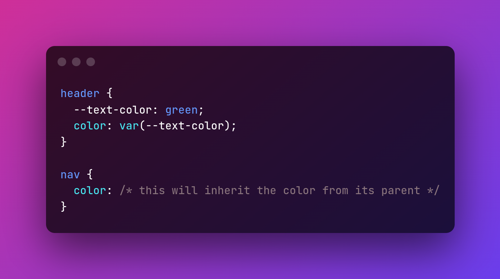
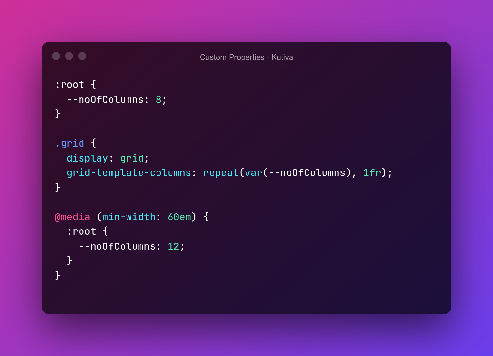

# CSS Custom Properties

Hey guys. Aqui Olimpio. Neste video iremos desvendar um pooco sobre os segredos das Variaveis CSS, oficialmente chamadas de **CSS Custom Properties**. Nesse video entenderemos o que essa feature é, como funciona e tambem veremos 4 casos de uso em projectos reais para as CSS Custom Properties. 

[TOC]

## O que são CSS Custom Properties?

De forma sinples, **Custom Properties** permitem-nos armazenar valores de propriedades CSS para re-utilização nas nossas folhas de estilo. E de uma forma mais simples ainda, tornam possivel escrever variaveis de forma nativa no CSS sem a necessidade de usar um pre-processador CSS. Mas o que é pre-processador CSS? Bom, isso é topico para um futuro video. KKK

**Sintaxe**

Como podemos ver a sintaxe é simples, para criarmos uma custom property so temos que iniciar a nossa variável dentro de um selector CSS com -- seguido do nome da variável e por fim o valor que queremos armazenar. E para utilizarmos a variável so precisamos escrever a função var() e o nome da variavel que queremos re-utilizar como argumento da função var(--nomeDaVariavel).

### Características das Custom Properties

1. **Case Sensitive** 

   

   

2. **Escopo**

   Notem que selector dado a regra CSS define o escopo em que a custom property pode ser utilizada. Uma prática comum é definir as variáveis na pseudo-classe :root, para que possa ser aplicada globalmente em todo o seu documento HTML. Mas também é aconselhável limitar o escopo das suas variáveis.

   

   

3. **Herança**

   As variaveis são afectadas pelo conceito de herança em CSS. Isto significa que se não for definido um valor para uma variavel num determinado elemento, é utilizado o valor do elemento que o contem. No exemplo abaixo definimos a cor com a variável text-color e aplicamos a cor do texto do elemento header, sendo assim o elemento nav herdara a cor de texto do elemento header ja que nele esta contigo.
   
   

### Vantagens de usar Custom Properties

1. Não precisamos de nenhuma ferramenta para usar
2. Dinâmicas, tem o princípio de cascata e herança
3. Podemos manipular usando JavaScript
4. Podemos usar em estilos inline
5. Sintaxe fácil embora um pouco verbosa

## Quatro Use cases

Agora vamos ver 4 formas de aplicarmos as variáveis css nos nossos projectos. Lembrar que há varias outras formas de aplicar as custom properties em seus projectos. E mesmo as use cases aqui apresentadas não são soluções únicas para resolver problemas específicos em seus projectos.

### Color Pallete

Essa talvez seja uma das aplicações mais comuns de ver as custom properties serem usadas. Organizar a paleta de cores do projecto num único lugar e poder reutilizar essas cores ao longo do projecto.

### Responsive Grid

Custom properties podem nos ajudar a criar Grid layouts complexos, responsivos e fáceis de manter. Imagine que quiséssemos criar uma grid de 8 colunas e num certo breakpoint quiséssemos transformar essa 8 column-grid em 12-column-grid.

### Repeated Values

Suponhamos que temos um elemento que 100px de padding-top e todos os outros valores são os mesmo, o padding-top é consistente em todos os breakpoints mas os outros valores carecem de mudança. Uma das formas de resolver esse problema seria modificar os outros valores em cada breakpoint. Isso seria muito trabalhoso. 

Ao invés de modificarmos os valores em todos os breakpoints poderíamos criar uma variável que armazenasse esses valores e so modificaríamos o valor em uma linha de código

### Shorthand Properties

Se usarmos propriedades shorthands como border ou qualquer outra, e queremos mudar um valor dentro dessa propriedade shorthand em um outro elemento, ter que reescrever a propriedade de novo é muito tedioso. Usando Custom Properties, podemos alterar valores de shorthand properties sem ter que reescrever toda a proprieade. 

### Color Functions

Como vimos no exemplo acima, custom properties não representam somente todos os valores de uma propriedade mas tambem podemos usar para armazenar valores parcialmente. Tendo isso em mente podemos criar Funções para manipular cores em CSS. Uma das formas mais comuns de criar esse tipo de funções é usando a função HSLA para manipular cores em CSS. 

HSLA é uma função que nos permite determinar a cor nos nossos selectores CSS, seja cor de borda, cor de fundo ou cor de texto. Esssa função tem o formato H - S - L - A. Ela admite quatro parâmetros, que definem **H**ue = tom, **S**aturation = saturação e **L**ightness = luminosidade da cor.

O primeiro parâmetro **H**, define o tom (hue) da cor. O segundo parâmetro **S**, define a saturação (saturation), o terceiro **L**, define a luminosidade(lightness) da cor e por fim o ultimo parâmetro **A** que é um canal Alpha que define a opacidade da cor. Mais sobre as funções de cores CSS num video futuro. 

Neste exemplo aplicamos uma cor verde claro a todos os paragrafos usando a função HSLA, mas notem que ao inves de usar os valores dos parametros HSLA somente, criamos variaveis que armazenam esses valores para possivel re-utilização dessas variaveis de modo a poder modificar os parametros. 

No segundo paragrafo queremos a alterar a cor de fundo, não precisamos reescrever a função toda. Somente pegar a variavel responsavel por alterar a cor e atualizar com a cor desejada, nesse caso o vermelho escuro. E olha que o mais interessante disso é que nem precisamos especificar a propriedade que queremos aplicar ao segundo paragrafo, a nossa variavel serve como uma custom property (duplo sentido). LOL

